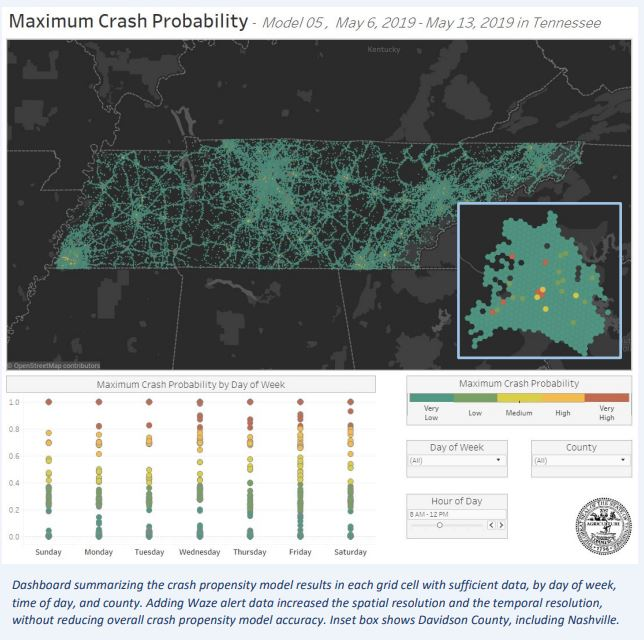

# README Outline:
* Project Description
* Prerequisites
* Usage
	* Building
	* Testing
	* Execution
* Additional Notes
* Version History and Retention
* License
* Contributions
* Contact Information
* Acknowledgements

# Project Description

### ROADII Use Case 25 - Traffic Incident Prediction through ML methods

- **Title:** Traffic Incident Prediction through ML methods
- **Purpose and goals of the project:** This use case aims to create a data collection and modeling process that will forecast crash probability for the next 4-7 days along highways and major roadways at a state-level. These data could be used for operations, management, and traveler information. 
- **Purpose of the source code and how it relates to the overall goals of the project:** This repository contains code and documentation for explorations in the generalization and deployment of techniques for detecting traffic incidents and assessing roadway network vulnerabilities using real-time and historical datasets. Intended audiences are state DOTs and traffic management centers wanting to improve their ability to respond quickly to incidents on their roadways, as well as to better understand how traffic incidents affect the larger roadway network.
- **Length of the project:** This use case is currently in the exploratory phase. The ROADII team has been updating 2019 work with the Tennessee Highway Patrol to forecast crash probability over the next week. The ROADII team has also been conducting stakeholder outreach with FHWA Office of Operations and state DOT Traffic Managment Centers to evaluate interest and feasibility of the use case. The ROADII team will be updating this repository as stable developments are created. This phase will likely continue through summer 2024. 

# Prerequisites

General Requirements:
- R 4.3.0 or later
- Historical Crash Data

Requirements for Predictions:
- Historical Waze Alert Data
- Historical Waze Jams Data 
- Weather Forecast

Requirements for Training:
- Historical Crash Data
- Historical Weather Data
- Historical Weather Data

# Usage

## Building

The [Code](https://github.com/ITSJPO-TRIMS/R25-IncidentPrediction/tree/main/Code) folder contains the code and installation instructions of the ROADII-Lab exploration of the traffic incident Prediction use case. It will be populated with functions, model code, training parameters, and eductional materials to help potential users or stakeholders with the development process for the deployment of their own traffic incident Prediction system. 

##File Structure

- The primary directory is R25-IncidentPrediction/Code/Incident_Prediction. All work should be done from the Incident_Prediction.Rproj R project. 
- The Analysis folder contains the primary R scripts used to run the Incident_Prediction tool. 
- The utility folder contains scripts used for data cleaning and database querying. Key parameters are passed to these scripts via the scripts in the Analysis folder. 
- The Input folder stores all raw data files including HSIS crash data, Open Street Maps road networks, Waze jams and alerts data, and weather data
- The Intermediate folder contains data that has undergone some cleaning and manipulation. The datacleaning and preparation process be computationally intensive so this folder provides storage for data that only needs to be cleaned once and then reused. 
- The Output folder contains the primary results from the Analysis scripts, including trained Random Forest models, model diagnostics, and predictions.

The steps to training models and generating predictions are as follows:

1.  Clone the GitHub environment to a location of your choosing on your machine
2.  Open Code/IncidentPrediction/Incident_Prediction.Rproj - all work needs to be done through this .Rproj file

If a trained model has already been created, skip to step 4

3.  Execute Analysis/RandomForest_Train.R

	RandomForest_Train.R trains a random forest model using historical Waze jams and alerts data, weather data, and roadway configuration data to predict crashes. The first time running this script may take more than an hour depending on the machine being used. Subsequent runs will be quicker but may take more than 30 minutes.
	
	Parameters to be set in Analysis/RandomForest_Train.R include:
	
	num: string, a name for the model being generated
	state: string, the state abbreviation for the state which predictions are being generated for   
	one_zone: boolean, value identifying whether or not the state consists of only one time zone. TRUE if the state consists of one and only one time zone.  
	time_zone_name: strong, the state's time zone. Must match a valid time zone listed in the OlsonNames function. Execute OlsonNames() to view valid time zone names  
	time_bins" boolean,  value indicating whether the tool should group data in 6-hour increments  
	
	Outputs include:  
	
	Model_{model_number}_RandomForest_Output.RData: a random forest model generated using the defined parameters.  
	AUC_{model_number}.pdf:  A pdf containing an Area-Under-Curve graph for the newly trained random forest model.  
	{model_number}_RandomForest_pred.csv: A csv containing the predictions performed on the test data used to train the random forest model.   
	Fitvars_{model_number}.csv: A .csv file containing the names of variables used to fit the random forest model.    
	importance_barplot{model_number}_{date}.png: A plot measuring the importance of each variable used in fitting the random forest model.   
	
4. Execute Analysis/PredictWeek.R
	
	PredictWeek.R joins the defined roadway network with predicted weather and imputed Waze data to predict where crashes will occur over the next 7 days.
	
	Parameters to be set in Analysis/RandomForest_Train.R include:
	
	num: string, the name of the random forest model to be used to predict crashes
	state: string, the state abbreviation for the state which predictions are being generated for   
	train_year: numeric, year where historical data is being pulled from. Also part of the name of the called random forest model
	train_imputed: boolean, a value indicating whether waze data shouild be imputed over the next week

	Outputs include:
	Output/Predict_Week_Outputs

## Utility Functions
 
 

The development team is currently building testing functions. For now, the recommended testing is examining the results to ensure they line up with general knowledge of roads and upcoming weather trends. 

# Additional Notes

The [Demos](https://github.com/ITSJPO-TRIMS/R25-IncidentPrediction/tree/main/Demos) folder contains pre-built demonstrations of the results of the analysis, data explorations, visualizations, and performance metrics for the solutions developed for this use case. This will be updated once more work is created with partner organizations. 

## Context on Previous Related Work
This use case builds on 2019 work that the Volpe Center did with Tennessee Highway Patrol under the U.S. DOT [Safety Data Initiative](https://www.transportation.gov/SafetyDataInitiative/Pilots).  The [Tennessee Integrated Traffic Analysis Network](https://www.transportation.gov/office-policy/transportation-policy/sdi-waze-project-summary-documents) (TITAN) crash model was built to be used by the Tennessee Highway Patrol (TN HP) to prioritize patrol locations. The model combined historical data such as fatal crashes and DUI arrests with current data including weather forecasts, and scheduled special events to generate heat maps that identifies areas of high likelihood for crashes. The TITAN model estimates crash propensity in 42 square mile grids. This resolution provides the most accurate estimates of fatal crash propensity in four hour time windows over the upcoming week, based on scheduled special events and weather forecasts. The objective of the TN HP and U.S. DOT SDI partnership was to test if Waze alerts can improve the spatial resolution of the TITAN model, particularly in urban areas. TN HP provided training data from the TITAN model, and the Volpe team quantitatively assessed the value that Waze data adds to the existing TITAN model.

**Known Issues:**

None identified. 

**Associated datasets:**

The internal ROADII team has explored a number of datasets that may suport the development of AI models to improve and generalize traffic incident Prediction systems. Some of these datasets are real-time and crowd sourced while others are historical and based on measurements of traffic characteristics over time.

* Waze Data

The Waze roadway incident and jams data are provided by the Waze for Cities Program (previously known as the Connected Citizens Program). These data are provided free by Waze to public agencies around the world, partly in exchange for participation in provisioning roadway closure data, and partly as a public service by Waze. Waze provides real-time, anonymous, proprietary incident and slow-down information directly from drivers, aggregate these data, and provides them to public agencies. Public agency partners provide real-time and advance information on construction, crash, and road closure data. 

The data are provided nationally across the US to the USDOT through a Memorandum of Understanding with the USDOT Chief Data Officer. The data have been stored in the USDOT Secure Data Commons (SDC) since spring 2017.
The stream of data from the Waze API is in JSON format, with an API call every 2 minutes. The structure of these data and fields are described in the Waze Traffic Data Specification Document, Version 2.7.1 (Waze_Traffic_Data_Spec.pdf). 

In SDC, these data are housed in a Redshift relational database. There are three main tables that are used in data analysis: alerts, jams, and jam point sequences. 

* HSIS Data

The Highway Safety Information System (HSIS) was developed by the Federal Highway Administration (FHWA) to address the need for a comprehensive, data-driven approach to highway safety. Highway engineers and administrators need to make informed decisions concerning the design and operation of the highway system, considering factors such as the geometric design of the roadway, the selection and placement of roadside hardware, the use of traffic control measures, the size and performance capabilities of the vehicles, and the needs and abilities of the users. To facilitate these decisions, it's important to have data about crashes, roadway geometrics, traffic control devices, traffic volume, and the location of hardware and obstacles on the roadside. This data needs to be in computerized files and easily linked so that it can be rapidly assembled and prepared for analysis.

The HSIS is a roadway-based system that provides quality data on a large number of accident, roadway, and traffic variables. It uses data already being collected by the States for managing the highway system and studying highway safety. HSIS can be used to analyze a wide range of safety problems, from basic "problem identification" issues to modeling efforts that attempt to predict future crashes from roadway characteristics and traffic factors. It is used in support of the FHWA safety research program and provides input for program policy decisions. HSIS is also available to professionals conducting research under the National Cooperative Highway Research Program, universities, and others studying highway safety.

* OpenStreetMap (OSM) Data

The updated use case will use OSM road segments, rather than grid cells. OSM is nationally available and includes all roads in the U.S. This use case will focus on [OSM's road classification](https://wiki.openstreetmap.org/wiki/United_States/Road_classification) on motorways (generally aligned to the National Highway System), but will eventually include all highway and arterial roads. 

# Version History and Retention

**Status:** This project is in active development phase. 

**Release Frequency:** This project will be updated when there are stable developments. This will be approximately every month. 

**Retention:** This project will likely remain publicly accessible indefinitely. 

**Release History:**  See [CHANGELOG.md](CHANGELOG.md)**

# License
This project is licensed under the Creative Commons 1.0 Universal (CC0 1.0) License - see the [License.MD](https://github.com/usdot-jpo-codehub/codehub-readme-template/blob/master/LICENSE) for more details. 

# Contributions
Please read [CONTRIBUTING.md](https://github.com/ITSJPO-TRIMS/R25-IncidentPrediction/blob/main/Contributing.MD) for details on our Code of Conduct, the process for submitting pull requests to us, and how contributions will be released.

# Contact Information

Contact Name: Eric Englin
Contact Information: Eric.Englin@dot.gov

Contact Name: Billy Chupp
Contact Information: William.Chupp@dot.gov

# Acknowledgements

*Sample citation should be in the below format, with the `formatted fields` replaced with details of your source code*

_`author_surname_or_organization`, `first_initial`. (`year`)._ `program_or_source_code_title` _(`code_version`) [Source code]. Provided by ITS/JPO and Volpe Center through GitHub.com. Accessed YYYY-MM-DD from `doi_url`._

## Citing this code

To cite this code in a publication or report, please cite our associated report/paper and/or our source code. Below is a sample citation for this code:

> ROADII Team. (2024). _ROADII README Template_ (0.1) [Source code]. Provided by ITS JPO through GitHub.com. Accessed 20214-02-23 from https://doi.org/xxx.xxx/xxxx.

When you copy or adapt from this code, please include the original URL you copied the source code from and date of retrieval as a comment in your code. Additional information on how to cite can be found in the [ITS CodeHub FAQ](https://its.dot.gov/code/#/faqs).

## Contributors

- Eric Englin (Volpe) 
- Dan Flynn (Volpe)
- Andrew Breck (Volpe)
- Joey Reed (Volpe)
- Robin Wilkinson (Volpe)
- Billy Chupp (Volpe)

The development of ROADII that contributed to this public version was funded by the U.S. Intelligent Transportation Systems Joint Program Office (ITS JPO) under IAA HWE3A122. Any opinions, findings, conclusions or recommendations expressed in this material are those of the authors and do not necessarily reflect the views of the ITS JPO.

